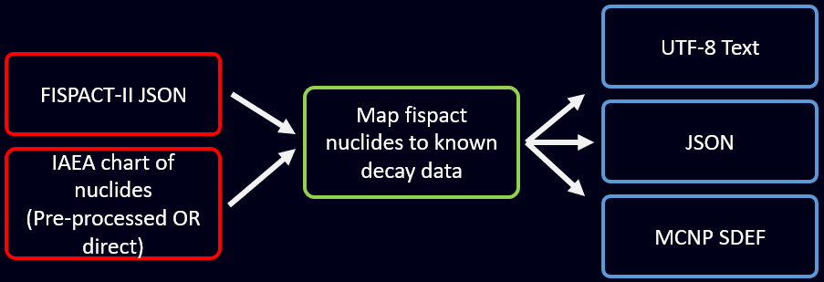
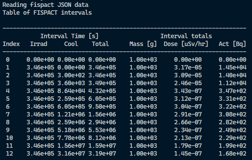
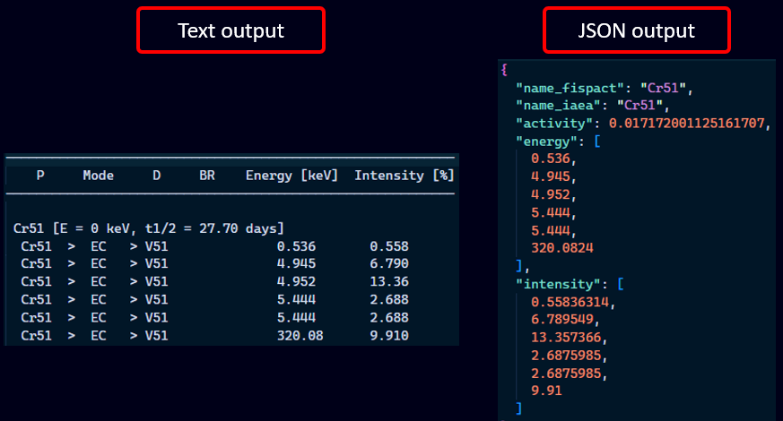
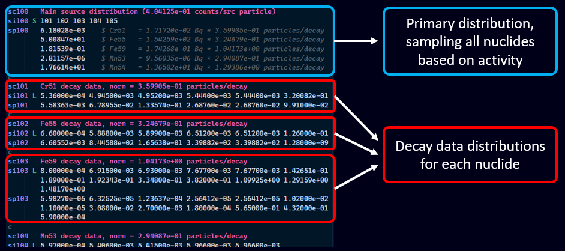
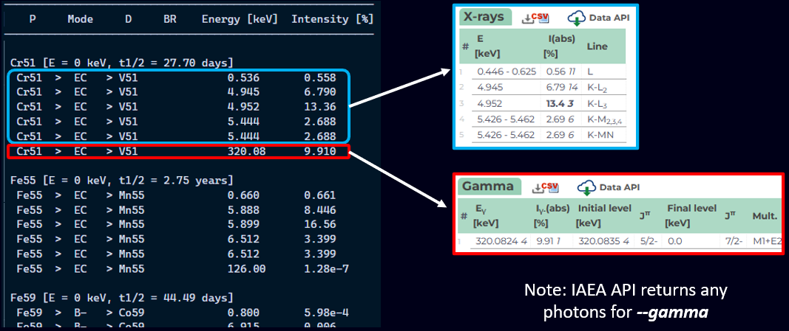
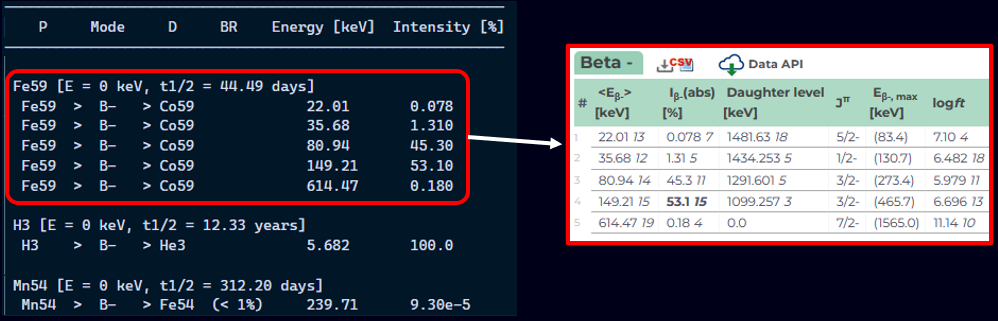
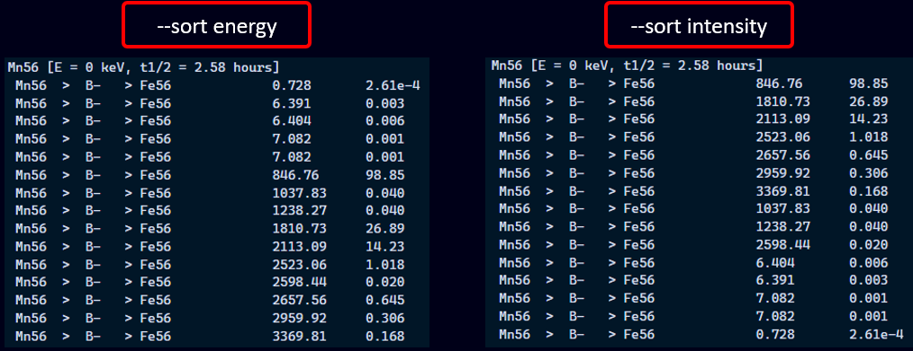

# FISPACT-II to decay source (`fisdef`)

Command line tool to convert FISPACT-II JSON results to decay sources.

```text
Usage: fisjson <path> [options]

Arguments:
  <path>                 Path to fispact JSON file
  [idx]                  Indices of time steps (optional)

Options:
  -v, --verbose...       Verbose logging (-v, -vv)
  -q, --quiet            Supress all logging
  -h, --help             Print help (see more with '--help')

Data options:
  -r, --rad <type>       Type of decay radiation
  -s, --sort <property>  Sort records by property ['energy', 'intensity']
      --fetch            Query IAEA directly rather than pre-fetched data

Output files:
  -o, --output <name>    Prefix for output files
  -t, --text             Text based table
  -j, --json             JSON output format
  -m, --mcnp             MCNP SDEF card
  -i, --id <num>         Starting MCNP distribution number

Note: --help shows more information and examples
```

Help is printed with the `-h` flag, and `--help` will show default values,
examples, and any important behaviour.

## Install

Direct from github:

```shell
cargo install --git https://github.com/repositony/fisdef.git
```

All executables are under `~/.cargo/bin/`, which should already be in your path
after installing Rust.

<details>
  <summary>Click here if you have never used Rust</summary><br />

If you have never used the Rust programming language, the toolchain is easily
installed from the [official website](https://www.rust-lang.org/tools/install)

### Unix (Linux/MacOS)

Run the following to download and run `rustup-init.sh`, which will install
the Rust toolchain for your platform.

```shell
curl --proto '=https' --tlsv1.2 -sSf https://sh.rustup.rs | sh
```

This should have added `source $HOME/.cargo/env` to the bash profile, so update
your environment with `source ~/.bashrc`.

### Windows

On Windows, download and run `rustup-init.exe` from the [official installs](https://www.rust-lang.org/tools/install).

</details>

## Overview

This tool takes the FISPACT-II nuclides for any number of calculation steps and
matches them to known decay data from the [IAEA chart of nuclides](https://www-nds.iaea.org/relnsd/vcharthtml/VChartHTML.html).



`fisdef` therefore supports all IAEA decay data types:

| Decay radiation type | IAEA symbol |
| -------------------- | ----------- |
| alpha                | a           |
| beta plus            | bp          |
| beta minus           | bm          |
| gamma                | g           |
| electron             | e           |
| x-ray                | x           |

Note that selecting 'gamma' will provide all photon data, including X-rays. This
is consistent with the data retrieved via the horrible IAEA API.

## Examples

### Summary of available calculation steps

This is always printed for reference, and when no arguments are provided this will be the default.

```bash
# Print a summary of intervals
fisdef /path/to/results.json
```



### Choosing specific intervals

If no intervals are defined, a source definition will be generated for every
calculation step.

There are several input methods included for convenience. For example, if there
were 5 calculation steps:

| `[idx]` argument | Expanded        | Note                 |
| ---------------- | --------------- | -------------------- |
| 1                | [1]             |                      |
| 0-2              | [0, 1, 2]       | Inclusive of upper   |
| "1 3 4"          | [1, 3, 4]       | Must be in quotation |
| all              | [0, 1, 2, 3, 4] |                      |
| left blank       | [0, 1, 2, 3, 4] | [default]            |

Any indices out of bounds are ignored.

```bash
# Choose specific steps (e.g. 5 total steps):
fisdef results.json    1
fisdef results.json   0-2
fisdef results.json "1 3 4"
fisdef results.json   all
fisdef results.json
```

### Choosing output formats

The following output formats are supported:

| Output format   | Flag              |
| --------------- | ----------------- |
| Utf-8 text file | `-t`/`--text`     |
| JSON            | `-j`/`--json`     |
| MCNP SDEF       | `-m`/`--mcnp`     |
| OpenMC          | work in progress  |

For example:

```bash
# Equivalent: creates 'step_2.i', 'step_2.json', 'step_2.txt'
fisdef results.json 2 --mcnp --json --text
fisdef results.json 2 -m -j -t
fisdef results.json 2 -mjt
```

The `--text` and `--json` files contain relevant nuclides with activity and
energy/intensity decay data. For example:



The `--mcnp` flag writes a source distribution of decay data for each nuclide,
and an overall activity-based distribution to sample from. For example:



Note that for MCNP SDEF, the distribution cards need an id. These are generated
sequentially from the value passed to `--id`. Defaults to `100`.

```bash
# Start from SI/SP 20 instead of 100
fisdef results.json 2 --mcnp --id 20
```

### Choosing output file prefix/name

Prefix for output files defaults to `step`.

Files are named `<name>_<n>.<ext>` where `<n>` is the index of the fispact time interval, and `<ext>` the appropriate extension.

For example:

```bash
# Change the prefix to myname
fisdef results.json 2 --mcnp --text --output myname
```

This generates `myname_2.i`/`mynmame_2.txt` instead of `step_2.i`/`step_2.txt`.

### Choosing decay data type

`fisdef` supports all IAEA decay data types.

The default is "gamma", however this may be changed using the `--rad`/`-r`
argument.

```bash
# Choose radiation type:
fisdef results.json --rad gamma        [default]
fisdef results.json --rad xray
fisdef results.json --rad alpha
fisdef results.json --rad beta-plus
fisdef results.json --rad beta-minus
fisdef results.json --rad electron
```

For example, `--rad gamma`:



Note that the IAEA API returns any photon emission for `gamma`, including X-rays. For X-ray data only, use `--rad x-ray`. For gamma-only, take it up with the IAEA.

For example, `--rad beta-minus` electrons:



### Choosing decay data order

By default, all decay data are ordered by energy.

To order by relative intensity (descending), use the `--sort`/`-s` argument.

For example:

```bash
# Choose output data sorting:
fisdef results.json --sort energy        [default]
fisdef results.json --sort intensity
```



### IAEA data options

It is **strongly recommended** to use the pre-compiled decay data (default).

If the absolute latest data are required and performance is not a concern, the
data may be fetched directly from the IAEA chart of nuclides API with the
`-f`/`--fetch` flag.

For example:

```bash
# Force decay data to be fetched direct from the IAEA chart of nuclides API
fisdef results.json --fetch ...
```

This obviously requires an internet connection.
